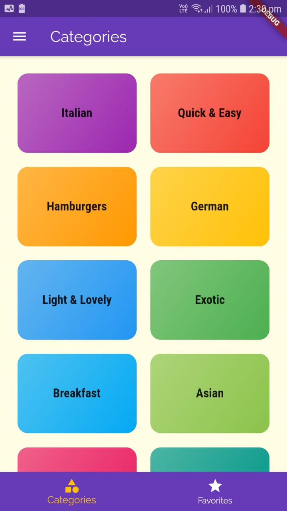
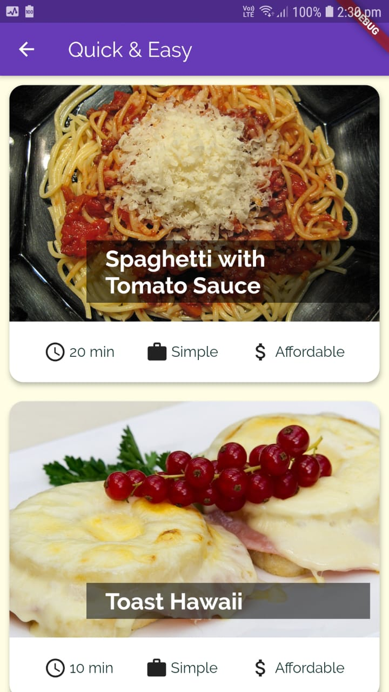
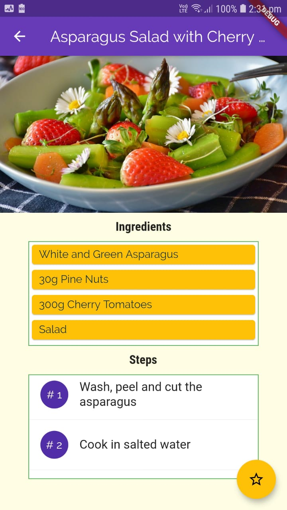

# SnackApp

Browse through the diverse collection of recipes of delicious snacks that satisfy your cravings. They provide not just recipes but overall instruction for easy cooking.

### Getting Started

1. Go to the project root. To get the required dependencies, execute the following command:

flutter pub get 

2. Check that an Android device is running. To run the app, execute the following command:

flutter run

3. After the app build completes, you will see the SnackApp on your device.

or

1. Install SnackApp.apk on an Android device to test the application.

### Learning Objectives

- Navigation basics
- Passing data between pages
- Tabs, Drawers & Dialogs

### Useful Resouces

- https://flutter.dev/docs/development/ui/navigation
- https://flutter.dev/docs/cookbook/navigation/navigate-with-arguments

### Screenshots

  
  
  

